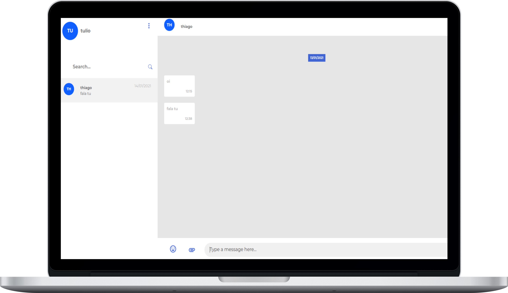

# Privoce - Papo Chat

<div align="center">



</div>

<div align="center">

## Papo chat frontend

</div>

<hr>
<bR>

<p align="center">


</p>

<div align="center">

### [🚀 Preview](https://papo.privoce.com/signin)

</div>

## 🚀 Usage:

🔃 Clone the project:

```bash
git clone https://github.com/Privoce/papo-chat-frontend
```

💻 Install dependencies:

```bash
yarn
#or
npm install
```

⚙ Setup the .env file:

```bash
# (use your favorite text editor)
cp .env.example .env
```

✅ Run:

```bash
yarn start
#or
npm start
```

<br>

<div align="center">

### Made with 💙 in Bahia, Brasil.

</div>
